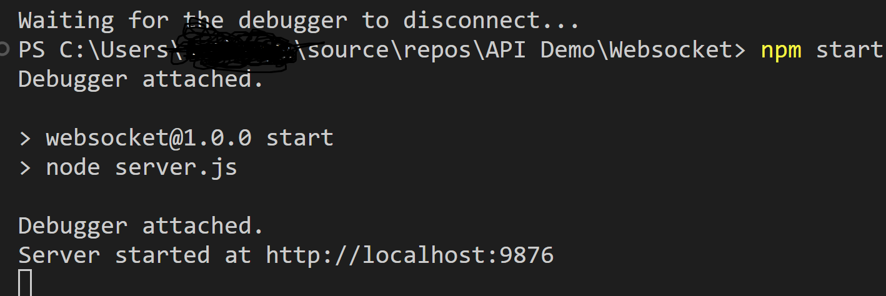
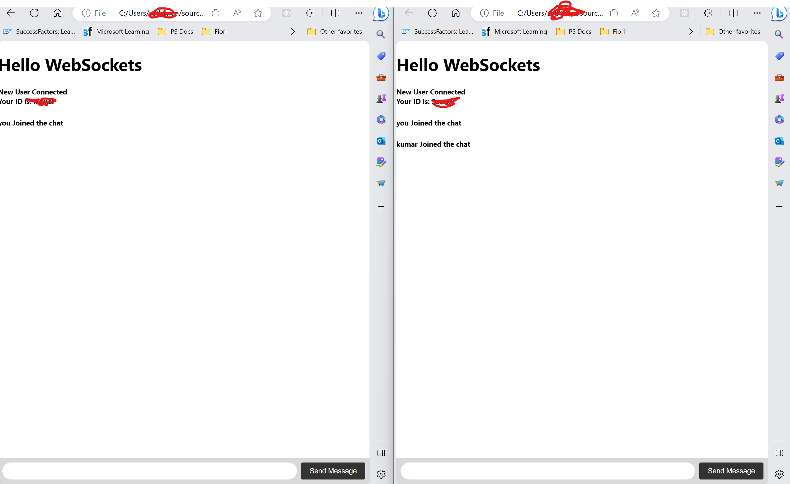

# Introduction
This example is to demonstrate Websocket functionality. This tutorial utilizes core Javascript Websocket package to host websocket server on node express through server.js. This sample also contains simple chat application which consumes websocket service and enable two way communication between server to client and vice versa.

# How to run this sample

 1. Clone the sample to local machine 
  
 ```console
    git clone https://github.com/sethanga_microsoft/Websocket.git
 ```

 2. Go to cloned folder and open the folder in vscode
    
 3. Start the websocket server
    Make sure you are in main project directory which is same as package.json
    
   ```console
    npm install    


    npm start  
   ```

websocket server will now be started and will listening in port 9846



4. Start the Client Application
Client application can be run directly on your browser. To start the client application ,navigate to folder <yourfolderpath>/websocket/client and then open index.html on browser.

To test as multiple participants , you can open this as multiple chat window


5. Start the server in Debug mode
Samples comes with .vscode folder which has node launch configuration which enables you start the debugging mode from vscode. 

    
